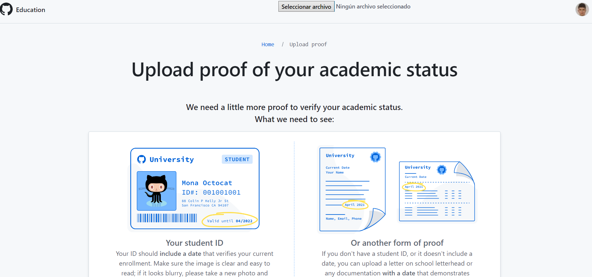
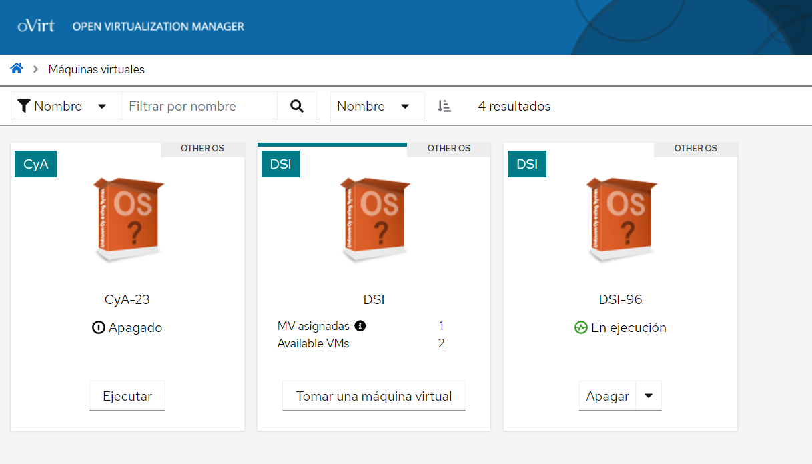
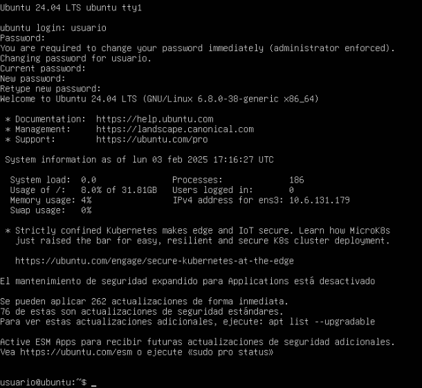
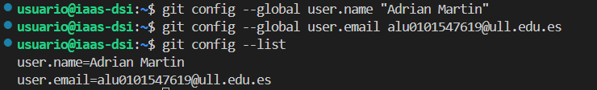
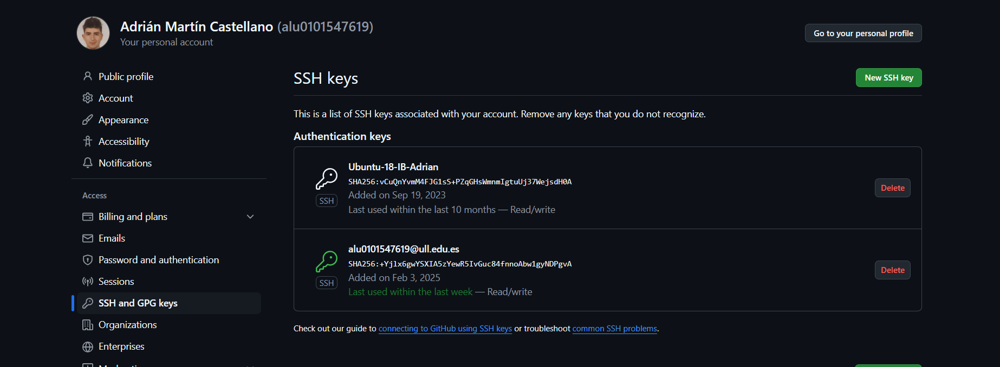
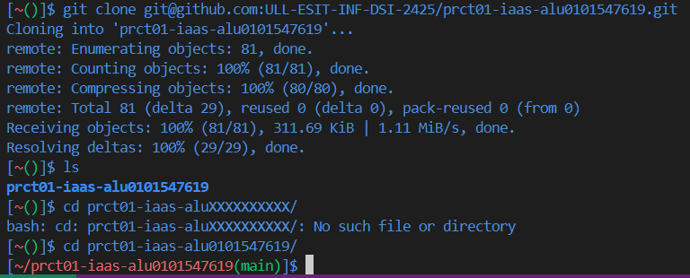
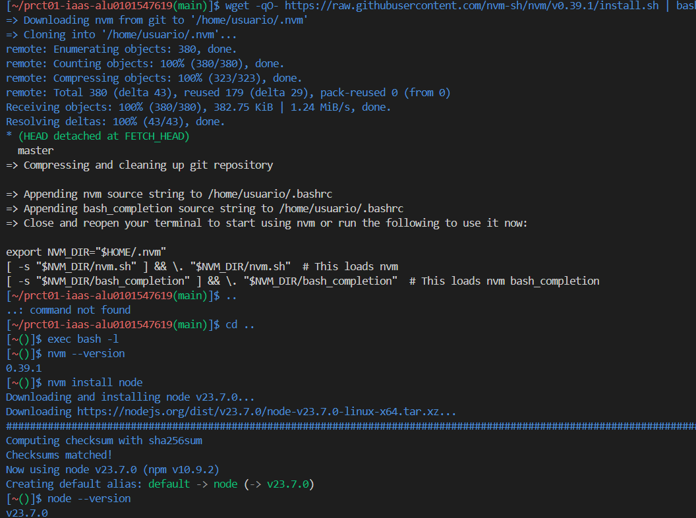

# Práctica 1: Configuración de máquina virtual en el IaaS
## Tareas previas

Para comenzar con la práctica, realizé unos pasos previos para poder configurar satisfactoriamente la máquina virtual de la asignatura.

### 1. Encuesta de elección de grupo de trabajo

Durante la asignatura deberemos de realizar varios trabajos en grupos de 3 personas. La elección de los mismos es propia, de manera consencuada lo integramos en una tarea que esta presente en el campus virtual. En mi caso, soy parte del grupo K.

### 2. Encuesta sobre expectativas y conocimientos previos

Encuesta realizada satisfactoriamente. La realización de la encuesta de forma anónima sirve al profesorado para el nivel y otros datos de interés del alumano matriculado en la signatura.

### 3. Cuenta instituacional de GitHub

Cuenta creada en otra asignatura anterior.

### 4. Beneficios de estudiantes de GitHub Education

Para poder solicitar los beneficios, hay que aclarar que somos estudiantes y además, especificar nuestro centro de estudio. A continuación, hay que aportar una documentación que identifique tu estudio durante este año donde se justifique tu nombre, el centro de estudio y alguna fecha actual. 
Como no lo había solicitado antes, tras su finalización, llegó a a la bandeja de correos un aviso de que llegará una respuesta desde el día de su realización hasta un máximo de 10 días por si la documentación aportada no es válida.



### 5. GitHub classroom

Mi cuenta de github ya estaba dado de alta por otra asignatura de la carrera, por lo que no tuve que realizar ningún paso.

### 6. Asignación de classroom

Al entrar en el enlace para aceptar la asiganción del classroom, aparecen los nombres de los alumnos matriculados para, una vez encontrado el mio, se debe de autentificar con las credenciales y posteriormente, dar el enlace del repositorio asociado y realizar este mismo informe en él.

### 7 y 8. Tutoriales acerca de GitHub, Markdowns, Pages

Para la realización de este informe, he necesitado la revisión y consulta de estos tutoriales ya sea para la inicialización y la funcionalidad de pages y el formato de Markdowns.

## Configuración de la máquina virtual en el IaaS

### Paso 1

Para poder trabajar sobre la máquina virtual sin estar conectado en la red de la Universidad de La Laguna hace falta configurar la VPN. Al haber cursado la asignatura IB (informátoca básica) durante el primer año de carrera, ya dispongo de una aplicación para realizar ese trabajo por lo que no nesesité realizar pasos ni consultar la documentación de configuración de la VPN de la ULL. 

A continuación, usando la VPN de la ULL, accedemos a `iaas.ull.es` (Servicio IaaS de la ULL) ingresando nuestras credenciales institucionales para poder tomar una MV (máquina virtual). Debido al contratiempo ocurrido donde algunas máquinas virtuales se corrompian por diversos motivos, podemos seleccionar hasta dos en el caso de no haber comenzado la práctica o simplemente tomar una nueva en el caso de ya disponer una pero sin estar en funcionamiento. Para saber que ya está tomada, debería de aparecer algo como `DSI-30`, en mi caso aparece `DSI-96`.



### Paso 2

Una vez que la MV aparece `en ejecución`, inicimamos la consola VNC para configurar algunos aspectos y datos del mismo.

La primera vez que iniciemos, nuestro usuario es `usuario`, al igual que la contraseña. Posteriormente, te pedira una contraseña nueva propia que esta se guardará para cada MV. Tras finalizar, se podrá usar la consola de la MV perfectamente.



### Paso 3

Para poder identificar la IP de la MV, hace falta instalarse unos paquetes necesarios para poder usar los comandos:
```
sudo apt install net-tools
...
ifconfig -a
```
Tras realizar dichos pasos, la IP de la MV es `10.6.131.179`. Ahora que tenemos la IP, podemos conectarnos remotamente usando SSH. En mi caso, como mi sistema operativo es window, el acceso remoto teng que hacerlo desde Visal Studio code mediante el comando `ssh usuario@10.6.131.179`. Para acceder finalmente, se ingresa el nomr¡bre de usuario que sigue siendo `usuario` y la nueva contraseña.
```
usuario@ubuntu:~$ cat /etc/hostname
ubuntu
usuario@ubuntu:~$ sudo vi /etc/hostname
usuario@ubuntu:~$ cat /etc/hostname
iaas-dsi
```
Estos ultimos comandos se usaron para cambiar el nombre del host de ubuntu a iaas-dsi. Para poder cambiar el fichero que se encuentra en `/etc/hostname`, se usó vi mediante varios comandos. como 'i' (insert) y 'x' para salir y guardar. El comando cat para imprimir por la terminal el contenido de dicho fichero.

Usamos vi también para cambiar el nombre del usuario de la MV desde el fichero /etc/hosts usando: 
```
usuario@ubuntu:~$ cat /etc/hosts
127.0.0.1	localhost
127.0.1.1	ubuntu
...

usuario@ubuntu:~$ sudo vi /etc/hosts

usuario@ubuntu:~$ cat /etc/hosts
127.0.0.1	localhost
127.0.1.1	iaas-dsi
```
Como resultado, en lugar de usuario@ubuntu, se verá `usuario@iaas-dsi`. Para que aparezca, es necesario reiniciar la MV mediante el comando `sudo reboot`.

### Paso 4

Como no dispondo de Linux, no puedo acceder al fichero en mi máquina local para acceder a la MV sin necesidad de poner la IP de la misma.
Posteriormente, se configura la clave pública-privada, puesto que no esta hecho. Esto lo podemos saber gracias al comando `cat .ssh/id_xxxxxxx.pub ` y su respuesta `cat: .ssh/id_xxxxxxx.pub: No such file or directory`.

Igualmente, no puedo configurar la maquina local por tener windows como sistema operativo con lo que no puedo realizar los cambios de acceso al ssh para cambiar el nombre de usuario o quitar la obligatoriedad de poner la contraseña cada vez que se haga ssh.

## Instalación de git y Node.js en la máquina virtual del IaaS

### Paso 1

Para instalar git en la máquina, usamos el siguiente comando:
```
usuario@iaas-dsi:~$ sudo apt install git
Reading package lists... Done
Building dependency tree
Reading state information... Done
git is already the newest version (1:2.25.1-1ubuntu3.2).
0 upgraded, 0 newly installed, 0 to remove and 0 not upgraded.
```
Tras esto, configuramos nuestro nombre y nuestro correo:


### Paso 2
Para cambiar el promt de la terminal para que este se cambie en base a la dirección del repositorio donde estemos hace falta descargar un script y agregar mediante vi dos lineas `PS1='\[\033]0;\u@\h:\w\007\]\[\033[0;34m\][\[\033[0;31m\]\w\[\033[0;32m\]($(git branch 2>/dev/null | sed -n "s/\* \(.*\)/\1/p"))\[\033[0;34m\]]$'` al final del propio fichero, volviendo a usar 'i' para insertar texto y 'x' para salir guardando. Se reinicia la terminal mediante `exec bash -l` para comprobar que ha funcionado.

A continuación, para tener configurado el git en la maquina, se coge la key generada aleatoriamente mediante `cat ~/.ssh/id_sra.pub` puesto que es el tipo de clave que yo quise usar. Entro en mi cuenta de github y en el apartado indicado agrego la nuevla clave quedando de esta manera: 



donde la nueva máquina se identifica por su nombre `alu0101547619@ull.edu.es`.

Para saber si se ha realizado corectamente los pasos anteriores, se realiza un `git-clone` del repositorio de la asignatura:



### Paso 3

Por último, se instalará los paquetes necesarios para trabajar con javascript, y por tanto, con typescript, que será el lenguaje que usaremos durante la asigntaura.

Comandos usados: 


